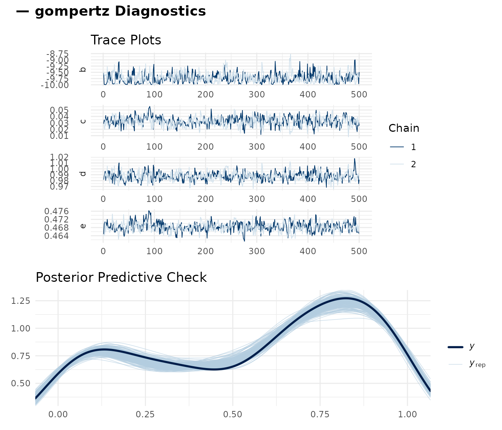
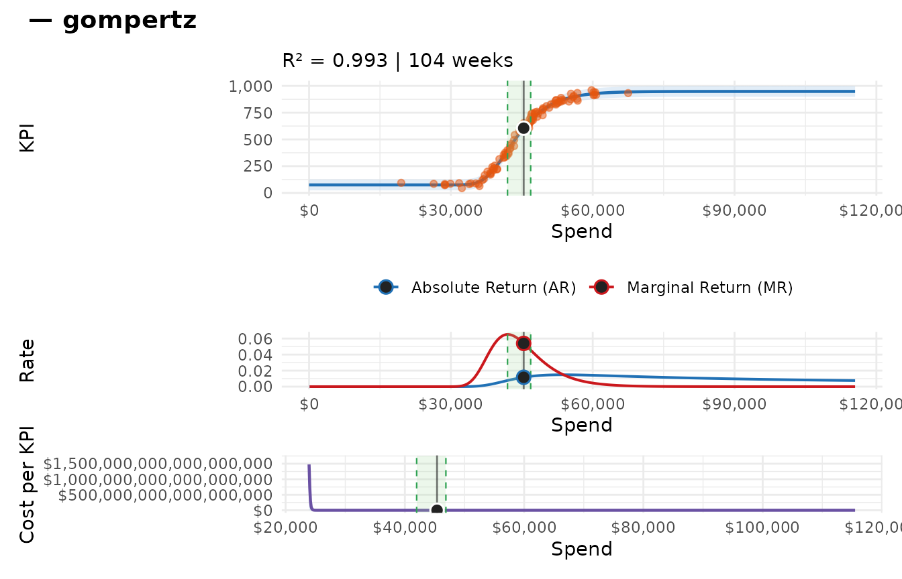
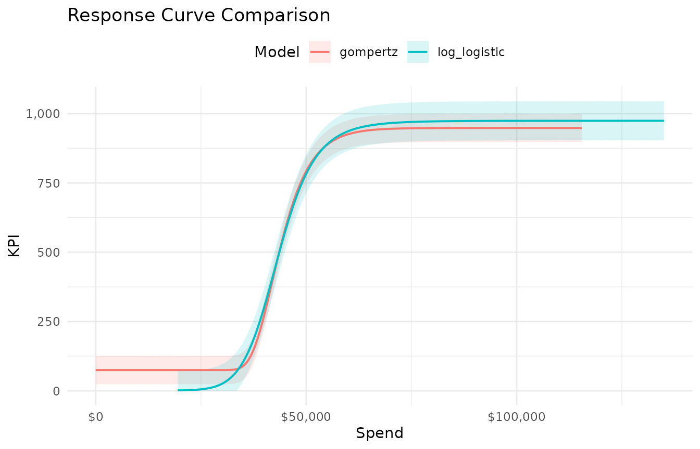
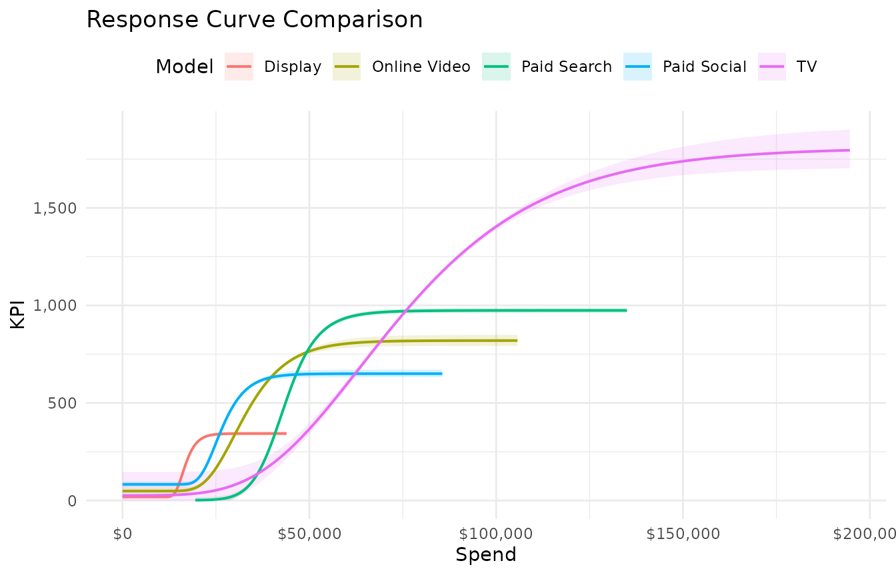
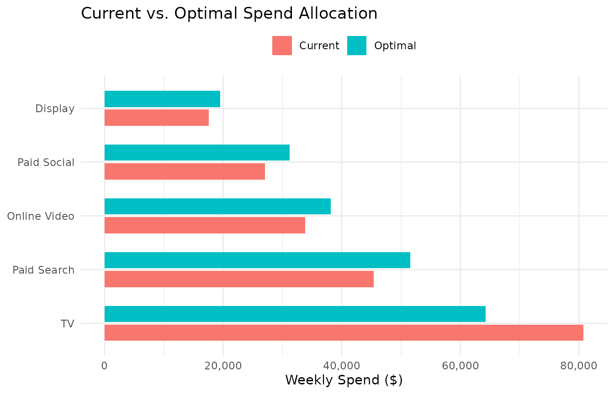
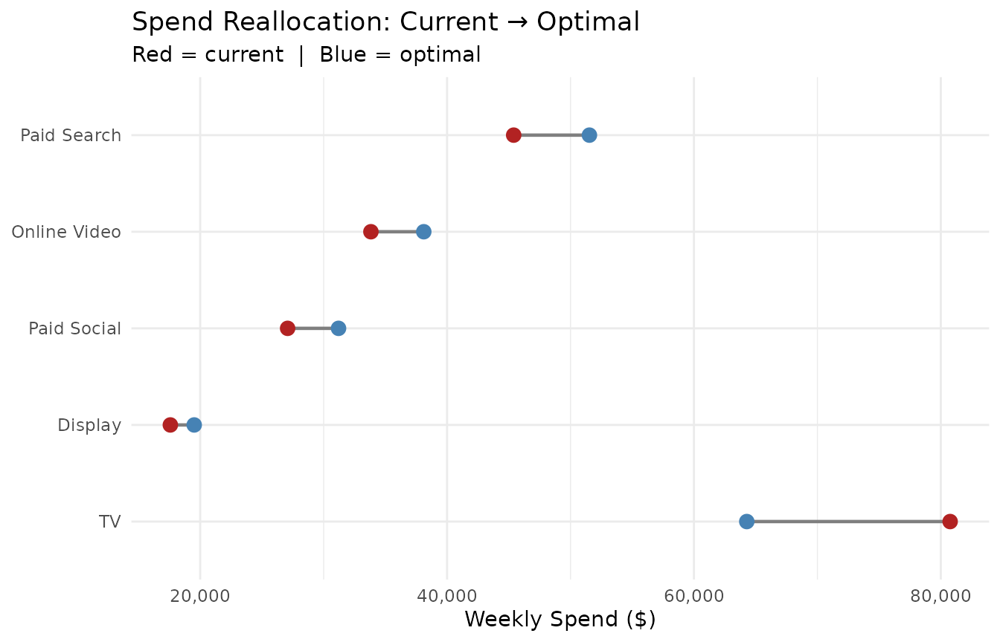
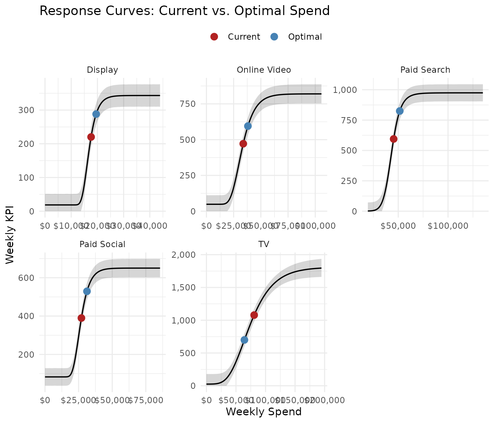
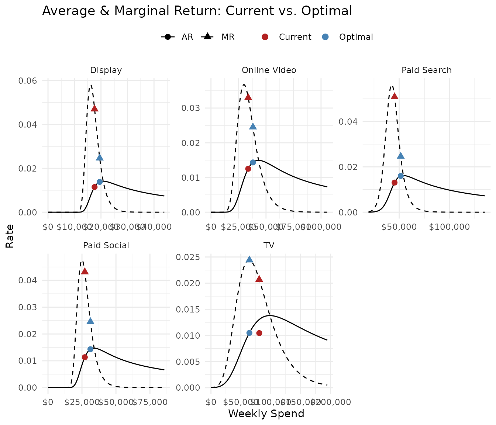
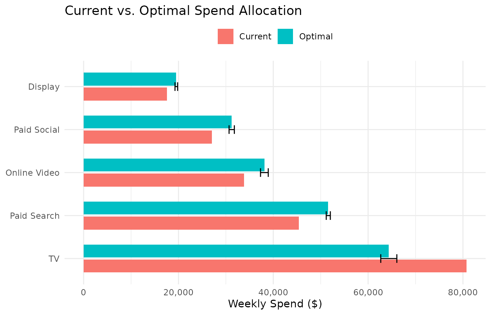
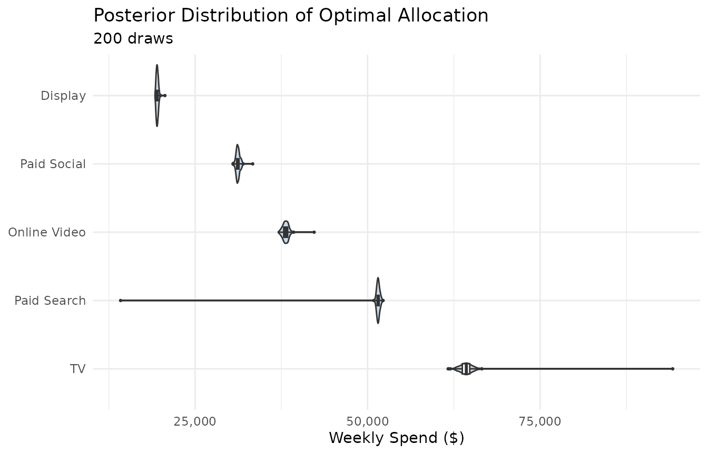

# Getting Started

This vignette walks through the full `mrmopt` workflow from raw data to
an optimized media allocation, using the built-in `mrmopt_data` dataset.
By the end you will have fit response curves for five channels, compared
curve types, checked diagnostics, and produced a budget optimization
with uncertainty.

------------------------------------------------------------------------

## Where mrmopt sits in the analytics stack

`mrmopt` is a **response curve and optimization layer**. It takes weekly
spend and attributed KPI data by channel — the kind of output produced
by an upstream Media Mix Model or Multi-Touch Attribution model — and
adds three things the upstream model typically doesn’t provide:

1.  **Nonlinear saturation curves** — explicitly modeling diminishing
    returns rather than assuming a linear relationship between spend and
    KPI
2.  **Bayesian uncertainty** — credible intervals on curves, marginal
    returns, and cost-per-unit that honestly reflect what the data does
    and doesn’t tell you
3.  **Uncertainty-aware optimization** — budget allocation that accounts
    for parameter uncertainty rather than optimizing against a single
    point estimate

`mrmopt` does not replace a joint MMM. It operates downstream of one.

------------------------------------------------------------------------

## The workflow

Every analysis in `mrmopt` follows the same iterative loop:

    Raw data
      └─► fit_response()          # Fit one channel, one curve type
            └─► mrm_plot_diagnostics()  # Check convergence
                  └─► mrms_plot_compare()  # Compare curve types
                        └─► fit_response()  # Best type, full iterations, all channels
                              └─► opt_mix()  # Optimize the portfolio
                                    └─► opt_summary() / opt_plot_*()

The two loops — convergence checking and curve type selection — are the
parts new users most often skip. Skipping them produces unreliable
curves and misleading optimization results. This vignette shows you what
to look for at each step.

------------------------------------------------------------------------

## The data

`mrmopt_data` is a built-in dataset with five media channels, each with
104 weeks (two years) of weekly spend and attributed conversions.

``` r

data(mrmopt_data)
mrmopt_data
#> # A tibble: 520 × 4
#>    channel     week       spend conversions
#>    <fct>       <date>     <dbl>       <int>
#>  1 Paid Search 2023-01-02 46306         616
#>  2 Paid Search 2023-01-09 38396         171
#>  3 Paid Search 2023-01-16 41434         334
#>  4 Paid Search 2023-01-23 46644         687
#>  5 Paid Search 2023-01-30 37157         166
#>  6 Paid Search 2023-02-06 47482         716
#>  7 Paid Search 2023-02-13 32331          45
#>  8 Paid Search 2023-02-20 28702          83
#>  9 Paid Search 2023-02-27 47682         739
#> 10 Paid Search 2023-03-06 48444         743
#> # ℹ 510 more rows
```

``` r

mrmopt_data |>
  group_by(channel) |>
  summarise(
    weeks        = n(),
    total_spend  = sum(spend),
    total_conv   = sum(conversions),
    avg_wk_spend = mean(spend),
    avg_wk_conv  = mean(conversions)
  )
#> # A tibble: 5 × 6
#>   channel      weeks total_spend total_conv avg_wk_spend avg_wk_conv
#>   <fct>        <int>       <dbl>      <int>        <dbl>       <dbl>
#> 1 Paid Search    104     4721083      57188       45395.        550.
#> 2 Paid Social    104     2816528      38719       27082         372.
#> 3 Display        104     1828456      20339       17581.        196.
#> 4 Online Video   104     3518235      45789       33829.        440.
#> 5 TV             104     8398316     107985       80753.       1038.
```

**Required format:** One row per channel-week. At minimum you need
`date`, `spend`, and `kpi` columns. An optional `units` column
(impressions, GRPs, clicks) unlocks cost-per-unit metrics. Channels are
modeled one at a time — filter to a single channel before calling
[`fit_response()`](https://bdshaff.github.io/mrmopt/reference/fit_response.md).

------------------------------------------------------------------------

## Step 1: Fit a response curve

Start with one channel and one curve type. Gompertz is a reasonable
default for channels with concave diminishing returns from the start.

``` r

ps_data <- mrmopt_data |> filter(channel == "Paid Search")

fit_ps <- fit_response(
  data           = ps_data,
  spend          = "spend",
  kpi            = "conversions",
  date           = "week",
  type           = "gompertz",
  midpoint_range = c(0.1, 0.5),
  ceiling_max    = 3,
  refresh        = 0
)
#> conversions ~ c + (d - c) * exp(-exp(b * (spend - e))) 
#> b ~ 1
#> c ~ 1
#> d ~ 1
#> e ~ 1
```

[`fit_response()`](https://bdshaff.github.io/mrmopt/reference/fit_response.md)
fits a Bayesian nonlinear model using Stan via `brms`. `midpoint_range`
and `ceiling_max` are scale-invariant prior controls — you do not need
to specify raw Stan priors unless you want to.

------------------------------------------------------------------------

## Step 2: Read the output

[`print()`](https://rdrr.io/r/base/print.html) gives a five-section
summary of the fitted model:

``` r

print(fit_ps)
#> -- Response Curve Summary: gompertz ------------------------------------------ 
#> Channel: spend
#> Weeks: 104
#> -- Current Performance ------------------------------------------------------- 
#> Weekly Spend: $45,395
#> KPI: 605  |  CP: $77  |  AR: 0.0117  |  MR: 0.0539
#> -- Parameters ---------------------------------------------------------------- 
#>   b (growth rate):     -2.03e-04
#>   c (floor):           75
#>   d (ceiling):         948
#>   e (midpoint):        $41,970
#> -- Response Curve Summary ---------------------------------------------------- 
#>   Min (peak MR):     $41,976  ->  KPI: 397  |  CP: $106
#>   Peak (peak AR):    $53,797  ->  KPI: 872  |  CP: $62
#>   Max (70% MR):      $46,877  ->  KPI: 678  |  CP: $69
#> 
#> 33.7% of weeks below range | 22.1% in range | 44.2% above range
#> -- Bayes R2 ------------------------------------------------------------------ 
#>   R2: 0.9930 (95% CI: [0.9925, 0.9932])
#> 
#> Use summary(x) for brms model diagnostics.
```

Reading this top to bottom:

- **Response Curve Summary** — the curve type and the channel/KPI
  columns used
- **Current Performance** — where the channel sits right now: weekly
  spend, KPI, cost-per-conversion, average return (AR), and marginal
  return (MR)
- **Parameters** — the four fitted curve parameters. `d` (ceiling) and
  `e` (midpoint) are the most interpretable: ceiling is the maximum
  predicted KPI, midpoint is the spend level where the curve is steepest
- **Response Curve Summary** — three reference points on the curve
  anchored to MR multiples, helping you see how much room is left to
  grow and how quickly returns are declining
- **Bayes R²** — a posterior distribution of explained variance. Higher
  is better; values below 0.4 suggest the curve may not be
  well-identified from this data

[`mrm_params()`](https://bdshaff.github.io/mrmopt/reference/mrm_params.md)
gives a focused table of just the four parameters:

``` r

mrm_params(fit_ps)
#> # A tibble: 4 × 6
#>   param name        description                         center    lower    upper
#>   <chr> <chr>       <chr>                                <dbl>    <dbl>    <dbl>
#> 1 b     Growth Rate Controls how quickly the curve r… -2.03e-4 -2.08e-4 -1.93e-4
#> 2 c     Floor       Baseline KPI level at zero spend…  7.49e+1  6.09e+1  8.80e+1
#> 3 d     Ceiling     Maximum achievable KPI at satura…  9.48e+2  9.36e+2  9.62e+2
#> 4 e     Midpoint    Spend level at the inflection po…  4.20e+4  4.17e+4  4.22e+4
```

------------------------------------------------------------------------

## Step 3: Check diagnostics

Before interpreting anything, confirm the model converged.

``` r

mrm_plot_diagnostics(fit_ps)
```



Two things to check:

- **Trace plots** — four chains should mix freely (overlap completely,
  no trends or drifts). If chains are separating or stuck, the model has
  convergence problems.
- **Posterior predictive check** — the blue posterior draws should
  envelope the black observed data line. A systematic gap means the
  curve form is misspecified.

The numerical indicators to target are **Rhat ≤ 1.01** and **Bulk ESS \>
400** for all parameters. These are printed in
[`mrm_summary()`](https://bdshaff.github.io/mrmopt/reference/mrm_summary.md):

``` r

summary(fit_ps)
#>  Family: gaussian 
#>   Links: mu = identity 
#> Formula: conversions ~ c + (d - c) * exp(-exp(b * (spend - e))) 
#>          b ~ 1
#>          c ~ 1
#>          d ~ 1
#>          e ~ 1
#>    Data: data (Number of observations: 104) 
#>   Draws: 4 chains, each with iter = 4000; warmup = 1000; thin = 1;
#>          total post-warmup draws = 12000
#> 
#> Regression Coefficients:
#>             Estimate Est.Error l-95% CI u-95% CI Rhat Bulk_ESS Tail_ESS
#> b_Intercept    -9.73      0.19    -9.99    -9.28 1.00     4396     3351
#> c_Intercept     0.03      0.01     0.02     0.05 1.00     5951     7092
#> d_Intercept     0.99      0.01     0.97     1.00 1.00     6083     6870
#> e_Intercept     0.47      0.00     0.46     0.47 1.00     5796     6483
#> 
#> Further Distributional Parameters:
#>       Estimate Est.Error l-95% CI u-95% CI Rhat Bulk_ESS Tail_ESS
#> sigma     0.03      0.00     0.02     0.03 1.00     7671     6468
#> 
#> Draws were sampled using sampling(NUTS). For each parameter, Bulk_ESS
#> and Tail_ESS are effective sample size measures, and Rhat is the potential
#> scale reduction factor on split chains (at convergence, Rhat = 1).
```

If convergence is poor, try increasing `iter` and `warmup`, or adjust
the priors with a tighter `midpoint_range`.

------------------------------------------------------------------------

## Step 4: Visualize the response curve

Once convergence is confirmed, look at the curve itself:

``` r

mrm_plot(fit_ps)
```



This dashboard shows three panels:

- **Response curve** — KPI vs. spend with posterior credible band. The
  current operating point is marked.
- **Average & marginal return** — AR and MR curves. Where MR is well
  below AR, the channel is in the diminishing returns zone. Where MR ≈
  AR, it is underinvested.
- **Cost-per** — cost-per-conversion across the spend range. Flat or
  declining cost-per means the channel absorbs more spend efficiently.

------------------------------------------------------------------------

## Step 5: Compare curve types

`mrmopt` supports six curve forms. The right choice depends on the data
— some channels have S-shaped response (low returns at very low spend,
peak efficiency in the middle, diminishing returns at high spend) while
others show concave diminishing returns from the first dollar.

Fit a second type and compare them visually:

``` r

fit_ps_ll <- fit_response(
  data           = ps_data,
  spend          = "spend",
  kpi            = "conversions",
  date           = "week",
  type           = "log_logistic",
  midpoint_range = c(0.1, 0.5),
  ceiling_max    = 3,
  refresh        = 0
)
#> conversions ~ c + ((d - c)/(1 + exp(b * (log(spend) - log(e))))) 
#> b ~ 1
#> c ~ 1
#> d ~ 1
#> e ~ 1
```

``` r

mrms_plot_compare(
  list(gompertz = fit_ps, log_logistic = fit_ps_ll),
  interval = "predictio"
)
```



Prefer the curve that:

1.  Has tighter credible bands (better identified from the data)
2.  Has higher Bayes R²
3.  Shows no systematic gap between the predictive band and the data in
    the diagnostic PPC

For a full comparison across all six types, see the [Diagnostics &
Comparison](https://bdshaff.github.io/mrmopt/articles/diagnostics_and_comparison.md)
vignette.

------------------------------------------------------------------------

## Step 6: Fit all channels

Once you have a curve type for each channel, fit the full portfolio.
Here we use the best-fit type for each of the five channels in
`mrmopt_data`:

``` r

channel_types <- list(
  "Paid Search"  = "log_logistic",
  "Paid Social"  = "gompertz",
  "Display"      = "gompertz",
  "Online Video" = "gompertz",
  "TV"           = "gompertz"
)

fits <- lapply(names(channel_types), function(ch) {
  fit_response(
    data  = mrmopt_data |> filter(channel == ch),
    spend = "spend",
    kpi   = "conversions",
    date  = "week",
    type  = channel_types[[ch]],
    midpoint_range = c(0.1, 0.5),
    ceiling_max    = 3,
    refresh        = 0
  )
})
#> conversions ~ c + ((d - c)/(1 + exp(b * (log(spend) - log(e))))) 
#> b ~ 1
#> c ~ 1
#> d ~ 1
#> e ~ 1
#> conversions ~ c + (d - c) * exp(-exp(b * (spend - e))) 
#> b ~ 1
#> c ~ 1
#> d ~ 1
#> e ~ 1
#> conversions ~ c + (d - c) * exp(-exp(b * (spend - e))) 
#> b ~ 1
#> c ~ 1
#> d ~ 1
#> e ~ 1
#> conversions ~ c + (d - c) * exp(-exp(b * (spend - e))) 
#> b ~ 1
#> c ~ 1
#> d ~ 1
#> e ~ 1
#> conversions ~ c + (d - c) * exp(-exp(b * (spend - e))) 
#> b ~ 1
#> c ~ 1
#> d ~ 1
#> e ~ 1
names(fits) <- names(channel_types)
```

Compare all five on the same axes to get an immediate sense of relative
efficiency:

``` r

mrms_plot_compare(fits, interval = "confidence")
```



------------------------------------------------------------------------

## Step 7: Optimize the portfolio

[`opt_mix()`](https://bdshaff.github.io/mrmopt/reference/opt_mix.md)
finds the spend allocation that maximizes total KPI subject to a total
budget constraint. The default `method = "point"` uses the posterior
median parameters and runs in under a second:

``` r

opt <- opt_mix(fits, budget = 204641)
#> 
#> Optimization setup:
#>   Channels:       5 
#>   Method:         point 
#>   Weekly budget:  204,641 
#> 
#> Optimization converged (status: 4 )
#> Total weekly KPI: 2,937
```

[`opt_summary()`](https://bdshaff.github.io/mrmopt/reference/opt_summary.md)
prints a formatted allocation table:

``` r

opt_summary(opt)
#> -- Optimization Result (point) ----------------------------------------------- 
#> Budget: $204,641/week  |  Channels: 5
#> -- Optimal Allocation -------------------------------------------------------- 
#>   Channel           Weekly Spend    Weekly KPI          CP    Share 
#>   Paid Social            $31,207           529         $59   15.2%
#>   Paid Search            $51,531           825         $62   25.2%
#>   Online Video           $38,112           595         $64   18.6%
#>   Display                $19,514           288         $68    9.5%
#>   TV                     $64,278           700         $92   31.4%
#> -- Totals -------------------------------------------------------------------- 
#>   Optimal:  Spend $204,641  |  KPI 2,937  |  Avg CP $70
#>   Current:  Spend $204,641  |  KPI 2,755  |  Avg CP $74
#>   Change:   KPI +6.6%  |  CP $5
```

Reading the output:

- **Weekly Spend** — the optimal spend per channel at the given budget
- **Weekly KPI** — predicted conversions at the optimal spend
- **CP** — cost-per-conversion at the optimal point
- **Share** — share of total budget
- **Totals** — current vs. optimal KPI and cost-per, with the overall
  change

[`opt_table()`](https://bdshaff.github.io/mrmopt/reference/opt_table.md)
returns the same information as a tidy tibble for further analysis or
reporting:

``` r

opt_table(opt) |>
  select(channel, current_spend, optimal_spend, spend_delta_pct,
         current_kpi, optimal_kpi, kpi_delta_pct, cp_delta)
#> # A tibble: 6 × 8
#>   channel    current_spend optimal_spend spend_delta_pct current_kpi optimal_kpi
#>   <chr>              <dbl>         <dbl>           <dbl>       <dbl>       <dbl>
#> 1 Paid Soci…        27082         31207.      0.152             390.        529.
#> 2 Paid Sear…        45395.        51531.      0.135             595.        825.
#> 3 Online Vi…        33829.        38112.      0.127             472.        595.
#> 4 Display           17581.        19514.      0.110             220.        288.
#> 5 TV                80753.        64278.     -0.204            1078.        700.
#> 6 TOTAL            204641.       204641       0.00000216       2755.       2937.
#> # ℹ 2 more variables: kpi_delta_pct <dbl>, cp_delta <dbl>
```

------------------------------------------------------------------------

## Step 8: Visualize the allocation

Two plot functions cover the most common views:

``` r

opt_plot_allocation(opt)
```



``` r

opt_plot_comparison(opt)
```



To see exactly where the optimal spend falls on each channel’s response
curve:

``` r

opt_plot_curves(opt)
```



And on the marginal return curves — the view that shows *why* the
optimizer moved spend the way it did:

``` r

opt_plot_returns(opt)
```



------------------------------------------------------------------------

## Step 9: Add uncertainty with posterior optimization

The point estimate result is fast but treats the posterior median
parameters as if they were known exactly. `method = "posterior"` runs
the optimizer over a sample of posterior draws, producing a distribution
of optimal allocations:

``` r

opt_post <- opt_mix(fits, budget = 204641, method = "posterior", n_draws = 200)
#> 
#> Optimization setup:
#>   Channels:       5 
#>   Method:         posterior 
#>   Weekly budget:  204,641 
#> 
#> Optimizing across 200 posterior draws...
#>   |                                                                              |                                                                      |   0%  |                                                                              |=                                                                     |   1%  |                                                                              |=                                                                     |   2%  |                                                                              |==                                                                    |   2%  |                                                                              |==                                                                    |   3%  |                                                                              |==                                                                    |   4%  |                                                                              |===                                                                   |   4%  |                                                                              |====                                                                  |   5%  |                                                                              |====                                                                  |   6%  |                                                                              |=====                                                                 |   6%  |                                                                              |=====                                                                 |   7%  |                                                                              |=====                                                                 |   8%  |                                                                              |======                                                                |   8%  |                                                                              |======                                                                |   9%  |                                                                              |=======                                                               |  10%  |                                                                              |========                                                              |  11%  |                                                                              |========                                                              |  12%  |                                                                              |=========                                                             |  12%  |                                                                              |=========                                                             |  13%  |                                                                              |=========                                                             |  14%  |                                                                              |==========                                                            |  14%  |                                                                              |==========                                                            |  15%  |                                                                              |===========                                                           |  16%  |                                                                              |============                                                          |  16%  |                                                                              |============                                                          |  17%  |                                                                              |============                                                          |  18%  |                                                                              |=============                                                         |  18%  |                                                                              |=============                                                         |  19%  |                                                                              |==============                                                        |  20%  |                                                                              |===============                                                       |  21%  |                                                                              |===============                                                       |  22%  |                                                                              |================                                                      |  22%  |                                                                              |================                                                      |  23%  |                                                                              |================                                                      |  24%  |                                                                              |=================                                                     |  24%  |                                                                              |==================                                                    |  25%  |                                                                              |==================                                                    |  26%  |                                                                              |===================                                                   |  26%  |                                                                              |===================                                                   |  27%  |                                                                              |===================                                                   |  28%  |                                                                              |====================                                                  |  28%  |                                                                              |====================                                                  |  29%  |                                                                              |=====================                                                 |  30%  |                                                                              |======================                                                |  31%  |                                                                              |======================                                                |  32%  |                                                                              |=======================                                               |  32%  |                                                                              |=======================                                               |  33%  |                                                                              |=======================                                               |  34%  |                                                                              |========================                                              |  34%  |                                                                              |========================                                              |  35%  |                                                                              |=========================                                             |  36%  |                                                                              |==========================                                            |  36%  |                                                                              |==========================                                            |  37%  |                                                                              |==========================                                            |  38%  |                                                                              |===========================                                           |  38%  |                                                                              |===========================                                           |  39%  |                                                                              |============================                                          |  40%  |                                                                              |=============================                                         |  41%  |                                                                              |=============================                                         |  42%  |                                                                              |==============================                                        |  42%  |                                                                              |==============================                                        |  43%  |                                                                              |==============================                                        |  44%  |                                                                              |===============================                                       |  44%  |                                                                              |================================                                      |  45%  |                                                                              |================================                                      |  46%  |                                                                              |=================================                                     |  46%  |                                                                              |=================================                                     |  47%  |                                                                              |=================================                                     |  48%  |                                                                              |==================================                                    |  48%  |                                                                              |==================================                                    |  49%  |                                                                              |===================================                                   |  50%  |                                                                              |====================================                                  |  51%  |                                                                              |====================================                                  |  52%  |                                                                              |=====================================                                 |  52%  |                                                                              |=====================================                                 |  53%  |                                                                              |=====================================                                 |  54%  |                                                                              |======================================                                |  54%  |                                                                              |======================================                                |  55%  |                                                                              |=======================================                               |  56%  |                                                                              |========================================                              |  56%  |                                                                              |========================================                              |  57%  |                                                                              |========================================                              |  58%  |                                                                              |=========================================                             |  58%  |                                                                              |=========================================                             |  59%  |                                                                              |==========================================                            |  60%  |                                                                              |===========================================                           |  61%  |                                                                              |===========================================                           |  62%  |                                                                              |============================================                          |  62%  |                                                                              |============================================                          |  63%  |                                                                              |============================================                          |  64%  |                                                                              |=============================================                         |  64%  |                                                                              |==============================================                        |  65%  |                                                                              |==============================================                        |  66%  |                                                                              |===============================================                       |  66%  |                                                                              |===============================================                       |  67%  |                                                                              |===============================================                       |  68%  |                                                                              |================================================                      |  68%  |                                                                              |================================================                      |  69%  |                                                                              |=================================================                     |  70%  |                                                                              |==================================================                    |  71%  |                                                                              |==================================================                    |  72%  |                                                                              |===================================================                   |  72%  |                                                                              |===================================================                   |  73%  |                                                                              |===================================================                   |  74%  |                                                                              |====================================================                  |  74%  |                                                                              |====================================================                  |  75%  |                                                                              |=====================================================                 |  76%  |                                                                              |======================================================                |  76%  |                                                                              |======================================================                |  77%  |                                                                              |======================================================                |  78%  |                                                                              |=======================================================               |  78%  |                                                                              |=======================================================               |  79%  |                                                                              |========================================================              |  80%  |                                                                              |=========================================================             |  81%  |                                                                              |=========================================================             |  82%  |                                                                              |==========================================================            |  82%  |                                                                              |==========================================================            |  83%  |                                                                              |==========================================================            |  84%  |                                                                              |===========================================================           |  84%  |                                                                              |============================================================          |  85%  |                                                                              |============================================================          |  86%  |                                                                              |=============================================================         |  86%  |                                                                              |=============================================================         |  87%  |                                                                              |=============================================================         |  88%  |                                                                              |==============================================================        |  88%  |                                                                              |==============================================================        |  89%  |                                                                              |===============================================================       |  90%  |                                                                              |================================================================      |  91%  |                                                                              |================================================================      |  92%  |                                                                              |=================================================================     |  92%  |                                                                              |=================================================================     |  93%  |                                                                              |=================================================================     |  94%  |                                                                              |==================================================================    |  94%  |                                                                              |==================================================================    |  95%  |                                                                              |===================================================================   |  96%  |                                                                              |====================================================================  |  96%  |                                                                              |====================================================================  |  97%  |                                                                              |====================================================================  |  98%  |                                                                              |===================================================================== |  98%  |                                                                              |===================================================================== |  99%  |                                                                              |======================================================================| 100%
#> 
#> Posterior optimization complete.
#> Median total weekly KPI: 2,935
```

``` r

opt_summary(opt_post)
#> -- Optimization Result (posterior, 200 draws) -------------------------------- 
#> Budget: $204,641/week  |  Channels: 5
#> -- Optimal Allocation -------------------------------------------------------- 
#>   Channel           Weekly Spend                  [95% CI]          CP    Share 
#>   Paid Social            $31,190     [$30,673 – $31,784]         $59  +15.2%
#>   Paid Search            $51,530     [$51,169 – $52,027]         $62  +25.2%
#>   Online Video           $38,119     [$37,304 – $38,936]         $64  +18.6%
#>   Display                $19,500     [$19,268 – $19,822]         $68   +9.5%
#>   TV                     $64,307     [$62,664 – $66,055]         $92  +31.4%
#> -- Totals -------------------------------------------------------------------- 
#>   Optimal:  Spend $204,646  |  KPI 2,935  |  Avg CP $70
#>   Current:  Spend $204,641  |  KPI 2,755  |  Avg CP $74
#>   Change:   KPI +6.6%  |  CP $5
```

The `[95% CI]` column shows the range of optimal spend across draws.
[`opt_plot_allocation()`](https://bdshaff.github.io/mrmopt/reference/opt_plot_allocation.md)
adds error bars:

``` r

opt_plot_allocation(opt_post)
```



And
[`opt_plot_posterior()`](https://bdshaff.github.io/mrmopt/reference/opt_plot_posterior.md)
shows the full spend distribution per channel:

``` r

opt_plot_posterior(opt_post)
```



Wide distributions signal channels where the data does not strongly
constrain the curve — the optimizer is uncertain about where to put
spend because the response is uncertain. Narrow distributions signal
well-identified channels where the allocation decision is robust.

------------------------------------------------------------------------

## Scenario analysis

[`opt_mix()`](https://bdshaff.github.io/mrmopt/reference/opt_mix.md)
supports several common scenario needs:

**Period budgets** — optimize a quarterly or annual budget broken into
weekly allocations:

``` r

opt_annual <- opt_mix(fits, budget = 26000000, n_weeks = 52)
#> 
#> Optimization setup:
#>   Channels:       5 
#>   Method:         point 
#>   Weekly budget:  5e+05 
#>   Period budget:  2.6e+07  ( 52  weeks)
#> 
#> Optimization converged (status: 4 )
#> Total weekly KPI: 4,592 
#> Total period KPI: 238,792
```

**Custom constraints** — set channel-level floors, ceilings, and share
bounds:

``` r

constraints <- data.frame(
  channel   = names(fits),
  min_spend = c(10000, 5000, 2000, 5000, 50000),
  max_spend = c(200000, 150000, 50000, 100000, 300000)
)

opt_constrained <- opt_mix(fits, budget = 204641, constraints = constraints)
#> 
#> Optimization setup:
#>   Channels:       5 
#>   Method:         point 
#>   Weekly budget:  204,641 
#> 
#> Optimization converged (status: 4 )
#> Total weekly KPI: 2,948
```

See the
[Optimization](https://bdshaff.github.io/mrmopt/articles/optimization.md)
vignette for the full constraint specification including share bounds
and fixed channels.

------------------------------------------------------------------------

## Where to go next

| Topic | Vignette |
|----|----|
| Mathematical derivations of all six curve forms | [Response Curve Theory](https://bdshaff.github.io/mrmopt/articles/response_curve_theory.md) |
