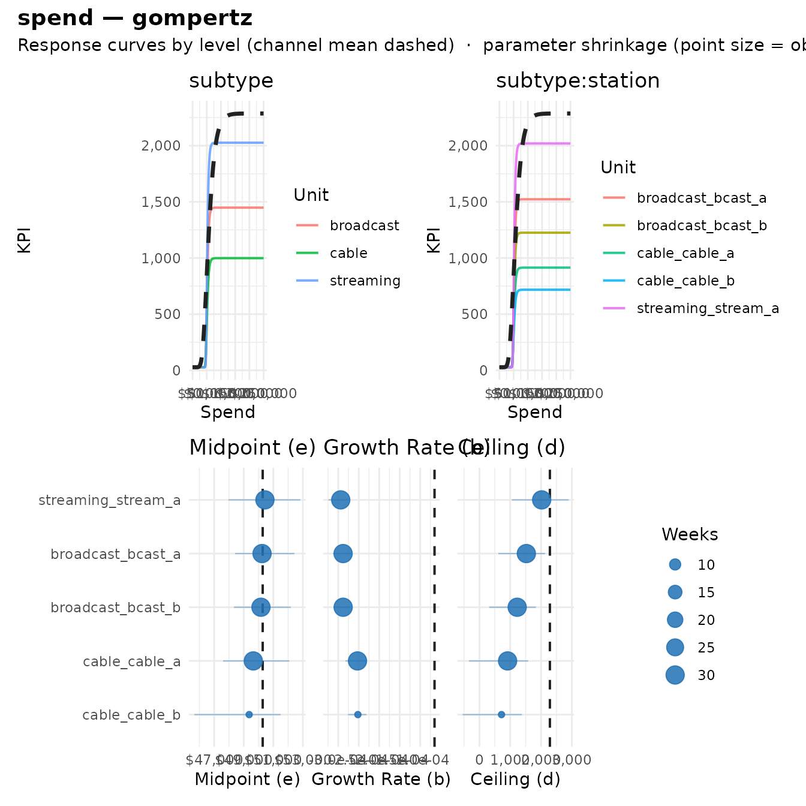
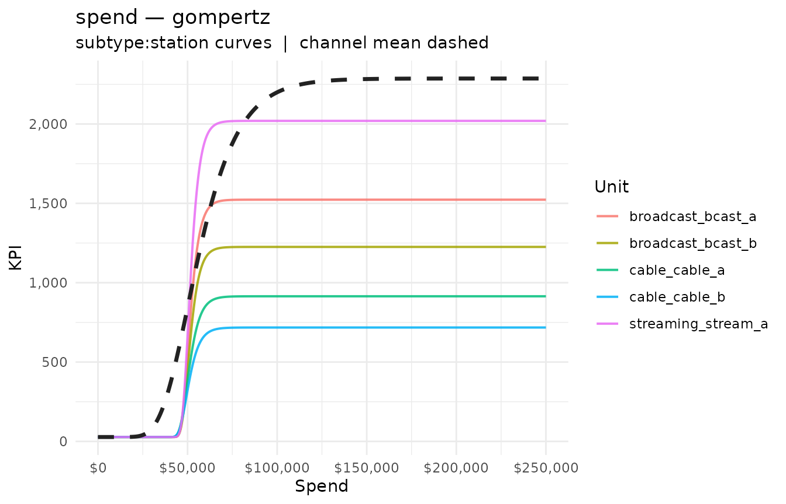
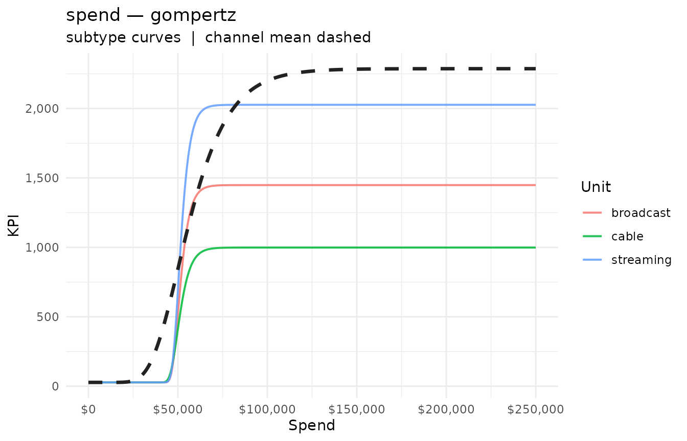
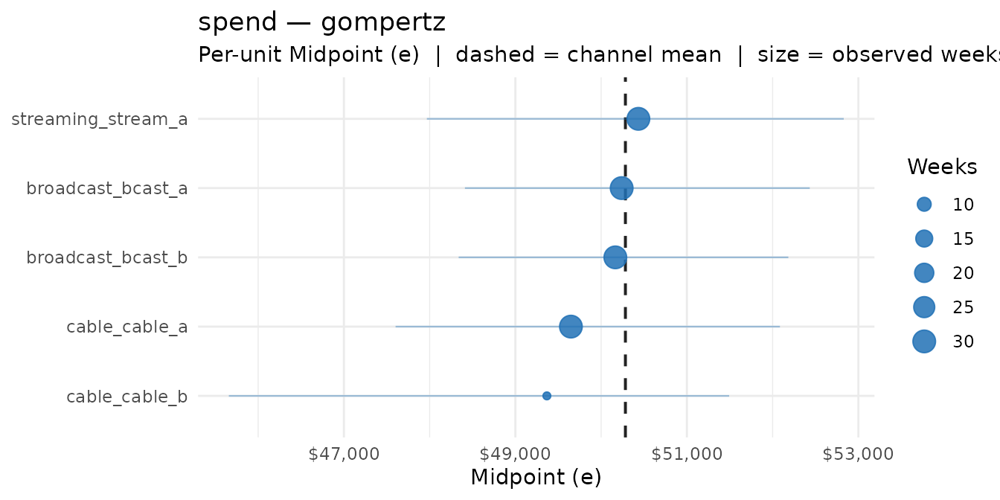
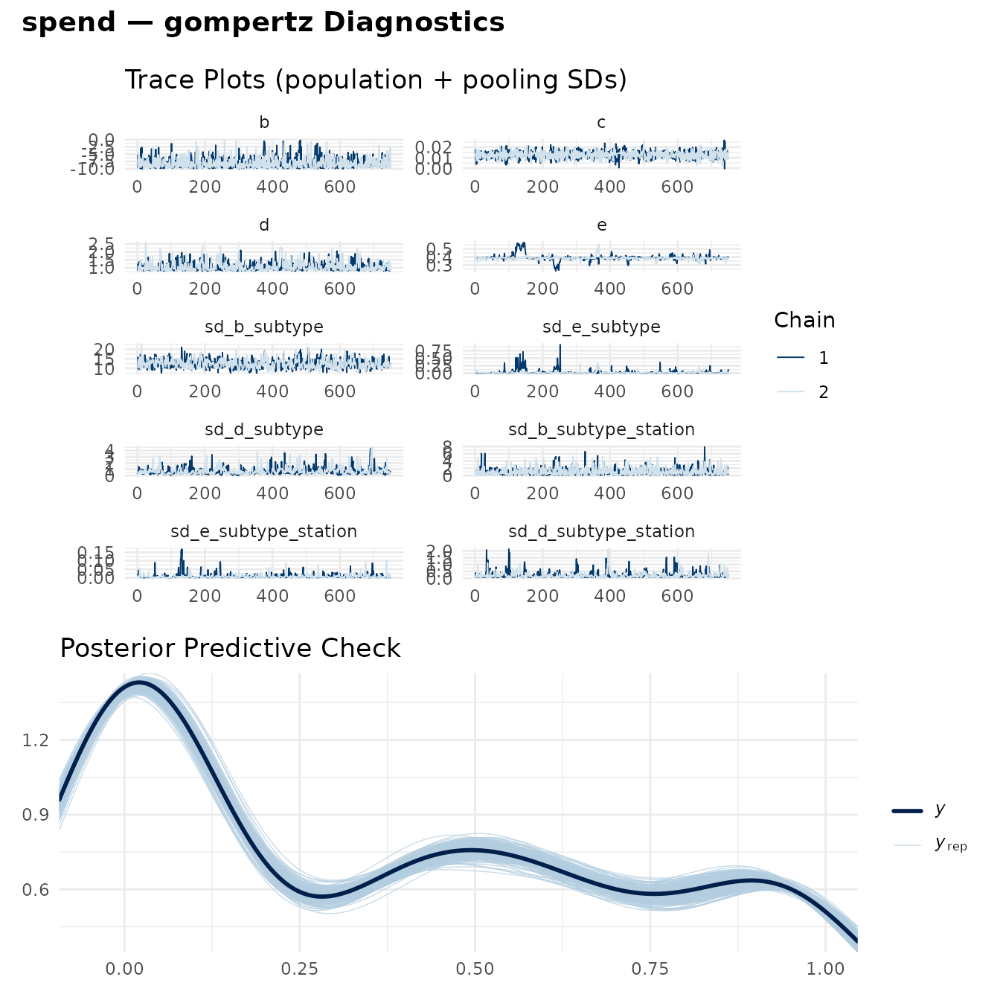
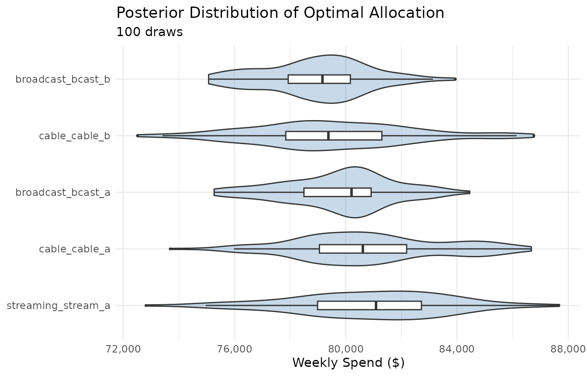

# Hierarchical Response Curves

Media channels are rarely homogeneous. TV spend spans broadcast, cable,
and streaming; each partner or station within those has its own reach
and response dynamics. Fitting one curve to the whole channel discards
that structure, while fitting a separate curve to every sub-unit
overfits the sparse ones.

[`fit_response_hier()`](https://bdshaff.github.io/mrmopt/reference/fit_response_hier.md)
fits a **single hierarchical model** for one channel where the curve
parameters are *partially pooled* across sub-channel groupings. Sparse
units borrow strength from their group; well-observed units stay close
to their own data. The degree of shrinkage is automatic and data-driven.

This vignette fits a two-level hierarchy (subtype → station), inspects
the per-level curves, visualizes the pooling, and optimizes a budget at
a chosen level of the hierarchy.

------------------------------------------------------------------------

## Simulated data

We simulate a TV channel with three subtypes and several stations each.
Curve *shape* (growth `b`, midpoint `e`) is similar across stations;
*scale* (ceiling `d`) varies with station size. One station — `cable_b`
— has only a handful of active weeks, so we can watch partial pooling
pull its estimate toward the cable group mean.

``` r

set.seed(2026)

gompertz <- function(x, d, e, b = -3e-4) d * exp(-exp(b * (x - e)))

# subtype -> station -> (ceiling d, n weeks)
spec <- list(
  broadcast = list(bcast_a = c(d = 1500, n = 30), bcast_b = c(d = 1200, n = 30)),
  cable     = list(cable_a = c(d =  900, n = 30), cable_b = c(d = 700,  n = 6)),
  streaming = list(stream_a = c(d = 2000, n = 30))
)

make_station <- function(subtype, station, d, n) {
  spend <- runif(n, 2e3, 1.3e5)
  mu    <- gompertz(spend, d = d, e = 5e4)
  data.frame(
    week    = seq.Date(as.Date("2024-01-01"), by = "week", length.out = n),
    subtype = subtype,
    station = station,
    spend   = spend,
    aa_opps = pmax(rnorm(n, mu, 0.05 * d), 0)
  )
}

tv <- do.call(rbind, unlist(lapply(names(spec), function(st) {
  lapply(names(spec[[st]]), function(stn) {
    p <- spec[[st]][[stn]]
    make_station(st, stn, d = p[["d"]], n = p[["n"]])
  })
}), recursive = FALSE))

tv |> count(subtype, station)
#>     subtype  station  n
#> 1 broadcast  bcast_a 30
#> 2 broadcast  bcast_b 30
#> 3     cable  cable_a 30
#> 4     cable  cable_b  6
#> 5 streaming stream_a 30
```

------------------------------------------------------------------------

## Fitting the hierarchical model

The call mirrors
[`fit_response()`](https://bdshaff.github.io/mrmopt/reference/fit_response.md),
with one new argument: `group`, a vector of grouping columns ordered
outermost → innermost. Here `c("subtype", "station")` fits the nested
structure `(1 | subtype) + (1 | subtype:station)` on the pooled
parameters.

By default the shape parameters (`b`, `e`) and the scale parameter (`d`)
are pooled, while the floor (`c`) stays at the channel level.
(Iterations are kept modest here to keep the vignette quick.)

``` r

fit_tv <- fit_response_hier(
  data   = tv,
  spend  = "spend",
  kpi    = "aa_opps",
  date   = "week",
  group  = c("subtype", "station"),
  type   = "gompertz",
  chains = 2,
  iter   = 1500,
  warmup = 750
)
```

Printing the fit shows the hierarchy, the channel-level mean curve, and
a per-station table:

``` r

fit_tv
#> -- Hierarchical Response Curve: gompertz ------------------------------------- 
#> Channel: spend  |  KPI: aa_opps
#> -- Hierarchy ----------------------------------------------------------------- 
#>   Level 1: subtype              3 unit(s)
#>   Level 2: station              5 unit(s)
#>   Pooled parameters: b, e, d
#> -- Channel-Level Parameters (mean curve) ------------------------------------- 
#>   b (growth rate):     -6.51e-05
#>   c (floor):           28
#>   d (ceiling):         2,287
#>   e (midpoint):        $50,283
#> -- Sub-Channel Units (5) ----------------------------------------------------- 
#>   unit                 wkly spend          KPI  ceiling (d)
#>   broadcast_bcast_a       $46,060           81        1,523
#>   broadcast_bcast_b       $57,739        1,098        1,225
#>   cable_cable_a           $61,965          876          914
#>   cable_cable_b           $57,117          626          718
#>   streaming_stream_a      $76,089        2,019        2,020
#> -- Bayes R2 ------------------------------------------------------------------ 
#>   R2: 0.9945 (95% CI: [0.9939, 0.9948])
#> 
#> Use summary(x) for brms diagnostics; mrm_summary_hier(x) for the full table.
```

------------------------------------------------------------------------

## Per-level summaries

[`mrm_summary_hier()`](https://bdshaff.github.io/mrmopt/reference/mrm_summary_hier.md)
returns one row per unit at every level of the hierarchy, plus a
channel-level row. The columns match the single-fit
[`mrm_summary()`](https://bdshaff.github.io/mrmopt/reference/mrm_summary.md),
with added `id` and `level` keys.

``` r

mrm_summary_hier(fit_tv) |>
  select(id, level, weekly_spend, kpi_at_current, d, e) |>
  arrange(level, id)
#> # A tibble: 9 × 6
#>   id                 level           weekly_spend kpi_at_current     d      e
#>   <chr>              <chr>                  <dbl>          <dbl> <dbl>  <dbl>
#> 1 (channel)          channel               60304.         1370.  2287. 50283.
#> 2 broadcast          subtype               51899.          795.  1448. 50205.
#> 3 cable              subtype               61157.          946.   999. 49711.
#> 4 streaming          subtype               76089.         2026.  2027. 50369.
#> 5 broadcast_bcast_a  subtype:station       46060.           80.9 1523. 50239.
#> 6 broadcast_bcast_b  subtype:station       57739.         1098.  1225. 50165.
#> 7 cable_cable_a      subtype:station       61965.          876.   914. 49647.
#> 8 cable_cable_b      subtype:station       57117.          626.   718. 49367.
#> 9 streaming_stream_a subtype:station       76089.         2019.  2020. 50434.
```

Notice the ceilings (`d`) track the sizes we simulated, and the sparse
station `cable_b` is pulled toward its cable peers rather than chasing
its own noisy data.

------------------------------------------------------------------------

## Visualizing the hierarchy

[`mrm_plot_hier()`](https://bdshaff.github.io/mrmopt/reference/mrm_plot_hier.md)
produces a **dashboard** (like
[`mrm_plot()`](https://bdshaff.github.io/mrmopt/reference/mrm_plot.md)
for single fits): a response-curve panel for each level of the
hierarchy, plus a shrinkage panel for each of the shape/scale parameters
(`e`, `b`, `d`).

``` r

mrm_plot_hier(fit_tv)
```



The individual panels are also exported as standalone functions when you
want just one.
[`mrm_plot_hier_response()`](https://bdshaff.github.io/mrmopt/reference/mrm_plot_hier_response.md)
shows one curve per unit at a level, overlaid with the channel mean
(dashed); it defaults to the innermost level:

``` r

mrm_plot_hier_response(fit_tv)
```



``` r

mrm_plot_hier_response(fit_tv, level = "subtype")
```



[`mrm_plot_hier_shrinkage()`](https://bdshaff.github.io/mrmopt/reference/mrm_plot_hier_shrinkage.md)
makes partial pooling explicit. Each unit’s parameter estimate is shown
with its credible interval; point size reflects the number of observed
weeks, and the dashed line marks the channel mean. Sparse units have
wider intervals and sit closer to the mean.

``` r

mrm_plot_hier_shrinkage(fit_tv, param = "e")
```



### Diagnostics

`mrm_plot_hier(type = "diagnostics")` (or
[`mrm_plot_hier_diagnostics()`](https://bdshaff.github.io/mrmopt/reference/mrm_plot_hier_diagnostics.md))
shows trace plots for the channel-level parameters and the
partial-pooling standard deviations, plus a posterior predictive check —
the hierarchical analogue of `mrm_plot(fit, type = "diagnostics")`.

``` r

mrm_plot_hier(fit_tv, type = "diagnostics")
```



------------------------------------------------------------------------

## Optimizing at any level

[`as_mrmfit_list()`](https://bdshaff.github.io/mrmopt/reference/as_mrmfit_list.md)
expands the hierarchical fit into a named list of single-curve models —
one per unit at a chosen level — that plugs directly into
[`opt_mix()`](https://bdshaff.github.io/mrmopt/reference/opt_mix.md).
This is how you optimize “at any level of the hierarchy.”

Optimize across individual stations (the innermost level):

``` r

station_models <- as_mrmfit_list(fit_tv, level = "subtype:station")
opt_stations   <- opt_mix(station_models, budget = 400000)
```

``` r

opt_table(opt_stations)
#> # A tibble: 6 × 18
#>   channel    current_spend optimal_spend spend_delta spend_delta_pct current_kpi
#>   <chr>              <dbl>         <dbl>       <dbl>           <dbl>       <dbl>
#> 1 streaming…        76089.        80548.       4459.          0.0586      2019. 
#> 2 broadcast…        46060.        79896.      33836.          0.735         80.9
#> 3 broadcast…        57739.        79059.      21321.          0.369       1098. 
#> 4 cable_cab…        61965.        80839.      18874.          0.305        876. 
#> 5 cable_cab…        57117.        79659.      22542.          0.395        626. 
#> 6 TOTAL            298969.       400000      101031.          0.338       4699. 
#> # ℹ 12 more variables: optimal_kpi <dbl>, kpi_delta <dbl>, kpi_delta_pct <dbl>,
#> #   current_cp <dbl>, optimal_cp <dbl>, cp_delta <dbl>,
#> #   current_spend_share <dbl>, optimal_spend_share <dbl>,
#> #   spend_share_shift <dbl>, current_kpi_share <dbl>, optimal_kpi_share <dbl>,
#> #   kpi_share_shift <dbl>
```

Or step up a level and optimize across subtypes:

``` r

subtype_models <- as_mrmfit_list(fit_tv, level = "subtype")
opt_subtypes   <- opt_mix(subtype_models, budget = 400000)
```

``` r

opt_table(opt_subtypes)
#> # A tibble: 4 × 18
#>   channel   current_spend optimal_spend spend_delta spend_delta_pct current_kpi
#>   <chr>             <dbl>         <dbl>       <dbl>           <dbl>       <dbl>
#> 1 streaming        76089.       130607.      54518.           0.716       2026.
#> 2 broadcast        51899.       130379.      78480.           1.51         795.
#> 3 cable            61157.       139014.      77857.           1.27         946.
#> 4 TOTAL           189145.       400000      210855.           1.11        3766.
#> # ℹ 12 more variables: optimal_kpi <dbl>, kpi_delta <dbl>, kpi_delta_pct <dbl>,
#> #   current_cp <dbl>, optimal_cp <dbl>, cp_delta <dbl>,
#> #   current_spend_share <dbl>, optimal_spend_share <dbl>,
#> #   spend_share_shift <dbl>, current_kpi_share <dbl>, optimal_kpi_share <dbl>,
#> #   kpi_share_shift <dbl>
```

Because each unit view carries its own posterior draws, the posterior
optimization path works too and propagates pooling-aware uncertainty
into the allocation:

``` r

opt_post <- opt_mix(station_models, method = "posterior",
                    budget = 400000, n_draws = 100, seed = 1)
```

``` r

plot(opt_post, type = "posterior")
```



------------------------------------------------------------------------

## Saturating (log-based) channels

The log-based forms (`log_logistic`, `weibull`, `reflected_weibull`) are
supported too. For these the midpoint enters as `log(e)`, which requires
`e > 0`; group-level deviations could otherwise drive it negative. The
fit handles this internally by reparameterizing the midpoint on the log
scale, then reporting `e` in the usual spend units — no change to how
you call it:

``` r

fit_tv_ll <- fit_response_hier(
  data  = tv,
  spend = "spend",
  kpi   = "aa_opps",
  date  = "week",
  group = c("subtype", "station"),
  type  = "log_logistic"
)
```

------------------------------------------------------------------------

## How pooling works

- **Fixed effects** are the channel-level mean curve.
- **Random effects** at each level (subtype, then subtype:station) are
  drawn from the level above, so a station’s curve is the channel mean
  plus its subtype deviation plus its own deviation.
- **Shrinkage is automatic**: units with more observations are pulled
  less toward the group mean; sparse units (like `cable_b`) are pulled
  more and carry wider credible intervals.
- **Shape pools, scale floats**: pooling concentrates on the shape
  parameters (`b`, `e`) while the ceiling (`d`) varies more freely to
  reflect genuine size differences across units.

See
[`?fit_response_hier`](https://bdshaff.github.io/mrmopt/reference/fit_response_hier.md)
for the full argument list, including `pool` (which parameters get group
effects), `group_sd_prior`, and `min_obs`. \`\`\`
