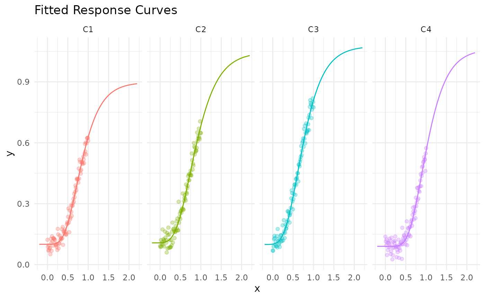

# Mix Optimization: A Simulated Example

``` r
library(mrmopt)
library(brms)
#> Loading required package: Rcpp
#> Loading 'brms' package (version 2.23.0). Useful instructions
#> can be found by typing help('brms'). A more detailed introduction
#> to the package is available through vignette('brms_overview').
#> 
#> Attaching package: 'brms'
#> The following object is masked from 'package:stats':
#> 
#>     ar
library(purrr)
library(dplyr)
#> 
#> Attaching package: 'dplyr'
#> The following objects are masked from 'package:stats':
#> 
#>     filter, lag
#> The following objects are masked from 'package:base':
#> 
#>     intersect, setdiff, setequal, union
library(tidyr)
library(ggplot2)
library(nloptr)
```

``` r
set.seed(123)
n = 100
C = 4
b_sim = rnorm(C, mean = -3, sd = 0.1)
c_sim = rnorm(C, mean = 0.1, sd = 0.01)
d_sim = rnorm(C, mean = 1, sd = 0.1)
e_sim = rnorm(C, mean = 0.7, sd = 0.1)

"logistic"
#> [1] "logistic"
"gompertz"
#> [1] "gompertz"
resp_forms = c("gompertz")

form_sim = sample(resp_forms, size = C, replace = TRUE)
resp_funcs = map(form_sim, ~rm_dispatch(.x))

x_sim = seq(0, 1, length.out = n)
y_sim = data.frame(matrix(NA, nrow = n, ncol = C))

for(i in 1:C) {
  y_sim[, i] = resp_funcs[[i]](x_sim, b = b_sim[i], c = c_sim[i], d = d_sim[i], e = e_sim[i]) +
    rnorm(n, mean = 0, sd = 0.03)
}

colnames(y_sim) = paste0("C", 1:C)
y_sim = 
  as_tibble(y_sim) %>%
  mutate(x = x_sim) %>%
  pivot_longer(cols = starts_with("C"), names_to = "channel", values_to = "y") %>%
  mutate(channel = factor(channel, levels = paste0("C", 1:C)))
```

``` r
ggplot(y_sim, aes(x = x, y = y, color = channel)) +
  geom_point(alpha = 0.5) +
  theme_minimal() +
  theme(legend.position = "none") +
  labs(x = "x", y = "y", title = "Simulated Data") +
  facet_wrap(~channel, ncol = 4)
```


``` r
channels = levels(unique(y_sim$channel))

response_models = list()
for(i in seq_along(channels)) {
  response_models[[channels[i]]] = fit_response(
    data = y_sim |> filter(channel == channels[i]),
    x = "x",
    y = "y",
    type = form_sim[i],
    auto = TRUE,
    chains = 2,
    iter = 2000, 
    warmup = 1000,
    seed = 007,
    control = list(adapt_delta = 0.90)
  )
}
#> y ~ c + (d - c) * exp(-exp(b * (x - e))) 
#> b ~ 1
#> c ~ 1
#> d ~ 1
#> e ~ 1
#> 
#> SAMPLING FOR MODEL 'anon_model' NOW (CHAIN 1).
#> Chain 1: 
#> Chain 1: Gradient evaluation took 0.000122 seconds
#> Chain 1: 1000 transitions using 10 leapfrog steps per transition would take 1.22 seconds.
#> Chain 1: Adjust your expectations accordingly!
#> Chain 1: 
#> Chain 1: 
#> Chain 1: Iteration:    1 / 2000 [  0%]  (Warmup)
#> Chain 1: Iteration:  200 / 2000 [ 10%]  (Warmup)
#> Chain 1: Iteration:  400 / 2000 [ 20%]  (Warmup)
#> Chain 1: Iteration:  600 / 2000 [ 30%]  (Warmup)
#> Chain 1: Iteration:  800 / 2000 [ 40%]  (Warmup)
#> Chain 1: Iteration: 1000 / 2000 [ 50%]  (Warmup)
#> Chain 1: Iteration: 1001 / 2000 [ 50%]  (Sampling)
#> Chain 1: Iteration: 1200 / 2000 [ 60%]  (Sampling)
#> Chain 1: Iteration: 1400 / 2000 [ 70%]  (Sampling)
#> Chain 1: Iteration: 1600 / 2000 [ 80%]  (Sampling)
#> Chain 1: Iteration: 1800 / 2000 [ 90%]  (Sampling)
#> Chain 1: Iteration: 2000 / 2000 [100%]  (Sampling)
#> Chain 1: 
#> Chain 1:  Elapsed Time: 2.481 seconds (Warm-up)
#> Chain 1:                2.483 seconds (Sampling)
#> Chain 1:                4.964 seconds (Total)
#> Chain 1: 
#> 
#> SAMPLING FOR MODEL 'anon_model' NOW (CHAIN 2).
#> Chain 2: 
#> Chain 2: Gradient evaluation took 4.9e-05 seconds
#> Chain 2: 1000 transitions using 10 leapfrog steps per transition would take 0.49 seconds.
#> Chain 2: Adjust your expectations accordingly!
#> Chain 2: 
#> Chain 2: 
#> Chain 2: Iteration:    1 / 2000 [  0%]  (Warmup)
#> Chain 2: Iteration:  200 / 2000 [ 10%]  (Warmup)
#> Chain 2: Iteration:  400 / 2000 [ 20%]  (Warmup)
#> Chain 2: Iteration:  600 / 2000 [ 30%]  (Warmup)
#> Chain 2: Iteration:  800 / 2000 [ 40%]  (Warmup)
#> Chain 2: Iteration: 1000 / 2000 [ 50%]  (Warmup)
#> Chain 2: Iteration: 1001 / 2000 [ 50%]  (Sampling)
#> Chain 2: Iteration: 1200 / 2000 [ 60%]  (Sampling)
#> Chain 2: Iteration: 1400 / 2000 [ 70%]  (Sampling)
#> Chain 2: Iteration: 1600 / 2000 [ 80%]  (Sampling)
#> Chain 2: Iteration: 1800 / 2000 [ 90%]  (Sampling)
#> Chain 2: Iteration: 2000 / 2000 [100%]  (Sampling)
#> Chain 2: 
#> Chain 2:  Elapsed Time: 1.766 seconds (Warm-up)
#> Chain 2:                2.568 seconds (Sampling)
#> Chain 2:                4.334 seconds (Total)
#> Chain 2: 
#> y ~ c + (d - c) * exp(-exp(b * (x - e))) 
#> b ~ 1
#> c ~ 1
#> d ~ 1
#> e ~ 1
#> 
#> SAMPLING FOR MODEL 'anon_model' NOW (CHAIN 1).
#> Chain 1: 
#> Chain 1: Gradient evaluation took 5.6e-05 seconds
#> Chain 1: 1000 transitions using 10 leapfrog steps per transition would take 0.56 seconds.
#> Chain 1: Adjust your expectations accordingly!
#> Chain 1: 
#> Chain 1: 
#> Chain 1: Iteration:    1 / 2000 [  0%]  (Warmup)
#> Chain 1: Iteration:  200 / 2000 [ 10%]  (Warmup)
#> Chain 1: Iteration:  400 / 2000 [ 20%]  (Warmup)
#> Chain 1: Iteration:  600 / 2000 [ 30%]  (Warmup)
#> Chain 1: Iteration:  800 / 2000 [ 40%]  (Warmup)
#> Chain 1: Iteration: 1000 / 2000 [ 50%]  (Warmup)
#> Chain 1: Iteration: 1001 / 2000 [ 50%]  (Sampling)
#> Chain 1: Iteration: 1200 / 2000 [ 60%]  (Sampling)
#> Chain 1: Iteration: 1400 / 2000 [ 70%]  (Sampling)
#> Chain 1: Iteration: 1600 / 2000 [ 80%]  (Sampling)
#> Chain 1: Iteration: 1800 / 2000 [ 90%]  (Sampling)
#> Chain 1: Iteration: 2000 / 2000 [100%]  (Sampling)
#> Chain 1: 
#> Chain 1:  Elapsed Time: 2.443 seconds (Warm-up)
#> Chain 1:                2.903 seconds (Sampling)
#> Chain 1:                5.346 seconds (Total)
#> Chain 1: 
#> 
#> SAMPLING FOR MODEL 'anon_model' NOW (CHAIN 2).
#> Chain 2: 
#> Chain 2: Gradient evaluation took 4.9e-05 seconds
#> Chain 2: 1000 transitions using 10 leapfrog steps per transition would take 0.49 seconds.
#> Chain 2: Adjust your expectations accordingly!
#> Chain 2: 
#> Chain 2: 
#> Chain 2: Iteration:    1 / 2000 [  0%]  (Warmup)
#> Chain 2: Iteration:  200 / 2000 [ 10%]  (Warmup)
#> Chain 2: Iteration:  400 / 2000 [ 20%]  (Warmup)
#> Chain 2: Iteration:  600 / 2000 [ 30%]  (Warmup)
#> Chain 2: Iteration:  800 / 2000 [ 40%]  (Warmup)
#> Chain 2: Iteration: 1000 / 2000 [ 50%]  (Warmup)
#> Chain 2: Iteration: 1001 / 2000 [ 50%]  (Sampling)
#> Chain 2: Iteration: 1200 / 2000 [ 60%]  (Sampling)
#> Chain 2: Iteration: 1400 / 2000 [ 70%]  (Sampling)
#> Chain 2: Iteration: 1600 / 2000 [ 80%]  (Sampling)
#> Chain 2: Iteration: 1800 / 2000 [ 90%]  (Sampling)
#> Chain 2: Iteration: 2000 / 2000 [100%]  (Sampling)
#> Chain 2: 
#> Chain 2:  Elapsed Time: 2.313 seconds (Warm-up)
#> Chain 2:                2.779 seconds (Sampling)
#> Chain 2:                5.092 seconds (Total)
#> Chain 2: 
#> y ~ c + (d - c) * exp(-exp(b * (x - e))) 
#> b ~ 1
#> c ~ 1
#> d ~ 1
#> e ~ 1
#> 
#> SAMPLING FOR MODEL 'anon_model' NOW (CHAIN 1).
#> Chain 1: 
#> Chain 1: Gradient evaluation took 8.1e-05 seconds
#> Chain 1: 1000 transitions using 10 leapfrog steps per transition would take 0.81 seconds.
#> Chain 1: Adjust your expectations accordingly!
#> Chain 1: 
#> Chain 1: 
#> Chain 1: Iteration:    1 / 2000 [  0%]  (Warmup)
#> Chain 1: Iteration:  200 / 2000 [ 10%]  (Warmup)
#> Chain 1: Iteration:  400 / 2000 [ 20%]  (Warmup)
#> Chain 1: Iteration:  600 / 2000 [ 30%]  (Warmup)
#> Chain 1: Iteration:  800 / 2000 [ 40%]  (Warmup)
#> Chain 1: Iteration: 1000 / 2000 [ 50%]  (Warmup)
#> Chain 1: Iteration: 1001 / 2000 [ 50%]  (Sampling)
#> Chain 1: Iteration: 1200 / 2000 [ 60%]  (Sampling)
#> Chain 1: Iteration: 1400 / 2000 [ 70%]  (Sampling)
#> Chain 1: Iteration: 1600 / 2000 [ 80%]  (Sampling)
#> Chain 1: Iteration: 1800 / 2000 [ 90%]  (Sampling)
#> Chain 1: Iteration: 2000 / 2000 [100%]  (Sampling)
#> Chain 1: 
#> Chain 1:  Elapsed Time: 1.649 seconds (Warm-up)
#> Chain 1:                2.071 seconds (Sampling)
#> Chain 1:                3.72 seconds (Total)
#> Chain 1: 
#> 
#> SAMPLING FOR MODEL 'anon_model' NOW (CHAIN 2).
#> Chain 2: 
#> Chain 2: Gradient evaluation took 4.8e-05 seconds
#> Chain 2: 1000 transitions using 10 leapfrog steps per transition would take 0.48 seconds.
#> Chain 2: Adjust your expectations accordingly!
#> Chain 2: 
#> Chain 2: 
#> Chain 2: Iteration:    1 / 2000 [  0%]  (Warmup)
#> Chain 2: Iteration:  200 / 2000 [ 10%]  (Warmup)
#> Chain 2: Iteration:  400 / 2000 [ 20%]  (Warmup)
#> Chain 2: Iteration:  600 / 2000 [ 30%]  (Warmup)
#> Chain 2: Iteration:  800 / 2000 [ 40%]  (Warmup)
#> Chain 2: Iteration: 1000 / 2000 [ 50%]  (Warmup)
#> Chain 2: Iteration: 1001 / 2000 [ 50%]  (Sampling)
#> Chain 2: Iteration: 1200 / 2000 [ 60%]  (Sampling)
#> Chain 2: Iteration: 1400 / 2000 [ 70%]  (Sampling)
#> Chain 2: Iteration: 1600 / 2000 [ 80%]  (Sampling)
#> Chain 2: Iteration: 1800 / 2000 [ 90%]  (Sampling)
#> Chain 2: Iteration: 2000 / 2000 [100%]  (Sampling)
#> Chain 2: 
#> Chain 2:  Elapsed Time: 1.697 seconds (Warm-up)
#> Chain 2:                1.692 seconds (Sampling)
#> Chain 2:                3.389 seconds (Total)
#> Chain 2: 
#> y ~ c + (d - c) * exp(-exp(b * (x - e))) 
#> b ~ 1
#> c ~ 1
#> d ~ 1
#> e ~ 1
#> 
#> SAMPLING FOR MODEL 'anon_model' NOW (CHAIN 1).
#> Chain 1: 
#> Chain 1: Gradient evaluation took 5.6e-05 seconds
#> Chain 1: 1000 transitions using 10 leapfrog steps per transition would take 0.56 seconds.
#> Chain 1: Adjust your expectations accordingly!
#> Chain 1: 
#> Chain 1: 
#> Chain 1: Iteration:    1 / 2000 [  0%]  (Warmup)
#> Chain 1: Iteration:  200 / 2000 [ 10%]  (Warmup)
#> Chain 1: Iteration:  400 / 2000 [ 20%]  (Warmup)
#> Chain 1: Iteration:  600 / 2000 [ 30%]  (Warmup)
#> Chain 1: Iteration:  800 / 2000 [ 40%]  (Warmup)
#> Chain 1: Iteration: 1000 / 2000 [ 50%]  (Warmup)
#> Chain 1: Iteration: 1001 / 2000 [ 50%]  (Sampling)
#> Chain 1: Iteration: 1200 / 2000 [ 60%]  (Sampling)
#> Chain 1: Iteration: 1400 / 2000 [ 70%]  (Sampling)
#> Chain 1: Iteration: 1600 / 2000 [ 80%]  (Sampling)
#> Chain 1: Iteration: 1800 / 2000 [ 90%]  (Sampling)
#> Chain 1: Iteration: 2000 / 2000 [100%]  (Sampling)
#> Chain 1: 
#> Chain 1:  Elapsed Time: 1.841 seconds (Warm-up)
#> Chain 1:                2.104 seconds (Sampling)
#> Chain 1:                3.945 seconds (Total)
#> Chain 1: 
#> 
#> SAMPLING FOR MODEL 'anon_model' NOW (CHAIN 2).
#> Chain 2: 
#> Chain 2: Gradient evaluation took 4.9e-05 seconds
#> Chain 2: 1000 transitions using 10 leapfrog steps per transition would take 0.49 seconds.
#> Chain 2: Adjust your expectations accordingly!
#> Chain 2: 
#> Chain 2: 
#> Chain 2: Iteration:    1 / 2000 [  0%]  (Warmup)
#> Chain 2: Iteration:  200 / 2000 [ 10%]  (Warmup)
#> Chain 2: Iteration:  400 / 2000 [ 20%]  (Warmup)
#> Chain 2: Iteration:  600 / 2000 [ 30%]  (Warmup)
#> Chain 2: Iteration:  800 / 2000 [ 40%]  (Warmup)
#> Chain 2: Iteration: 1000 / 2000 [ 50%]  (Warmup)
#> Chain 2: Iteration: 1001 / 2000 [ 50%]  (Sampling)
#> Chain 2: Iteration: 1200 / 2000 [ 60%]  (Sampling)
#> Chain 2: Iteration: 1400 / 2000 [ 70%]  (Sampling)
#> Chain 2: Iteration: 1600 / 2000 [ 80%]  (Sampling)
#> Chain 2: Iteration: 1800 / 2000 [ 90%]  (Sampling)
#> Chain 2: Iteration: 2000 / 2000 [100%]  (Sampling)
#> Chain 2: 
#> Chain 2:  Elapsed Time: 2.127 seconds (Warm-up)
#> Chain 2:                2.412 seconds (Sampling)
#> Chain 2:                4.539 seconds (Total)
#> Chain 2:
```

``` r
response_funs = map(response_models, ~mrm_response_function(.x))

x_sim = seq(-0.2, 2.2, length.out = 100)
map_dfr(response_funs, ~tibble(x = x_sim, y = .x(x_sim)), .id = "channel") %>%
  ggplot(aes(x = x, y = y, color = channel)) +
  geom_line() +
  theme_minimal() +
  theme(legend.position = "none") +
  labs(x = "x", y = "y", title = "Fitted Response Curves") +
  facet_wrap(~channel, ncol = 4) +
  geom_point(data = y_sim, aes(x = x, y = y), alpha = 0.3, inherit.aes = TRUE)
```



``` r
res = opt_mix(response_models, total = 4)
#> 
#> Number of channels:  4
#> Default x0: 0.915, 0.948, 0.8, 1.072
#> Default lb: 0.239, 0.246, 0.207, 0.284
#> Default ub: 3.339, 3.471, 2.937, 3.874
#> Default total constraint: sum(x) - total = 0
#> Total value: 2
sum(map2_dbl(response_funs, res$res$solution, ~.x(.y)))
#> [1] 1.26014
sum(map2_dbl(response_funs, rep(0.5, C), ~.x(.y)))
#> [1] 0.9090824

map2_dbl(response_funs, res$res$solution, ~.x(.y))
#>         C1         C2         C3         C4 
#> 0.10793545 0.12630245 0.93303554 0.09286651
```

``` r
p = plot_optimal_mix(res)
plotly::ggplotly(p)
```
