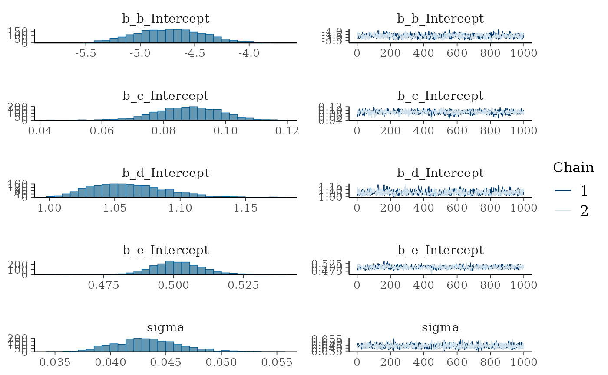
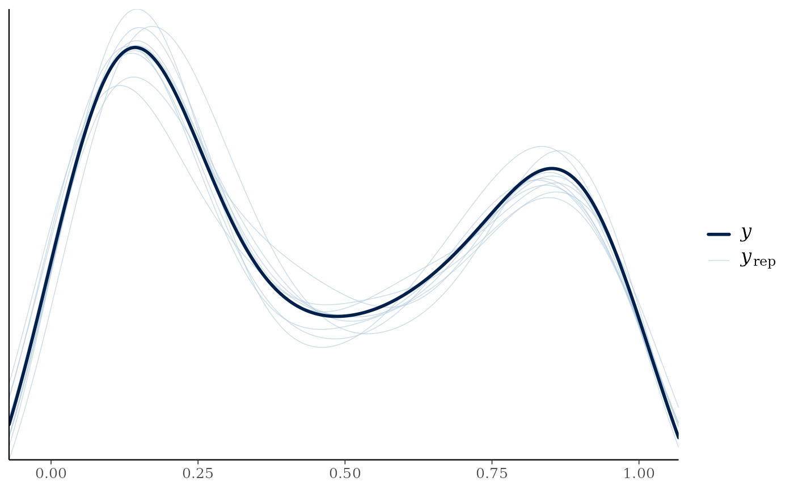
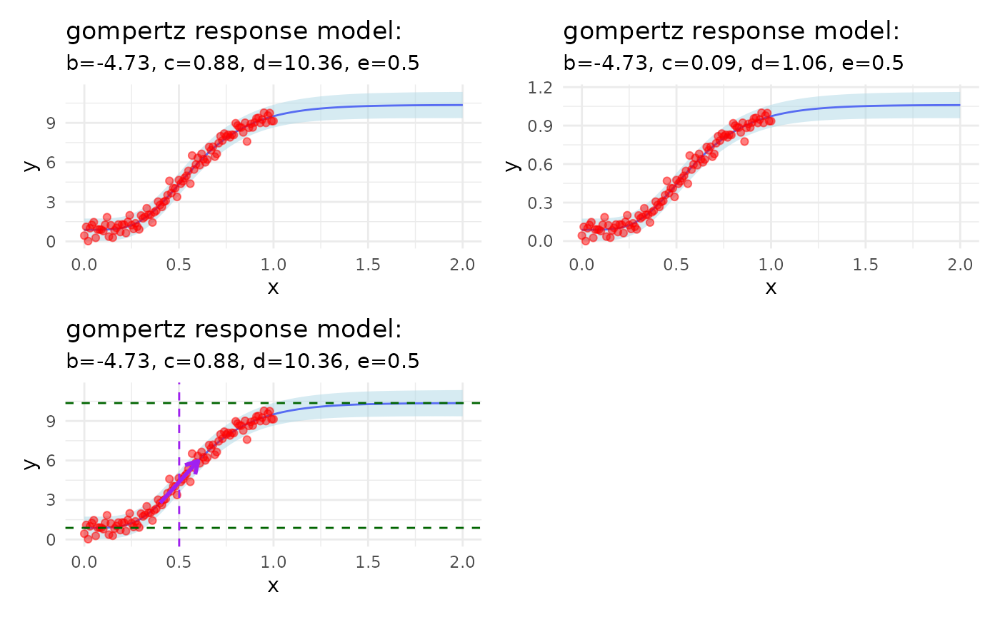
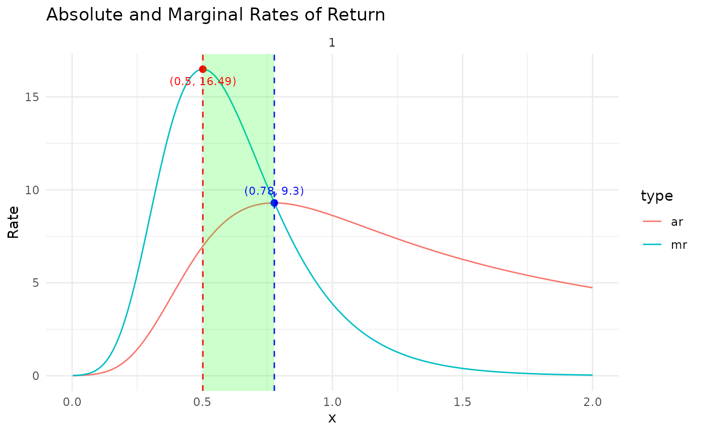

# Fitting a Response Model: A Simulated Example

``` r
library(mrc)
library(brms)
#> Loading required package: Rcpp
#> Loading 'brms' package (version 2.23.0). Useful instructions
#> can be found by typing help('brms'). A more detailed introduction
#> to the package is available through vignette('brms_overview').
#> 
#> Attaching package: 'brms'
#> The following object is masked from 'package:stats':
#> 
#>     ar
library(purrr)
library(gt)
library(dplyr)
#> 
#> Attaching package: 'dplyr'
#> The following objects are masked from 'package:stats':
#> 
#>     filter, lag
#> The following objects are masked from 'package:base':
#> 
#>     intersect, setdiff, setequal, union
library(ggplot2)
library(patchwork)
```

``` r

x_values <- seq(0, 1, by = 0.01)

b <- -5
c <- 1
d <- 10
e <- 0.5

y_response = rm_Gompertz(x_values, b, c, d, e) + rnorm(length(x_values), mean = 0, sd = 0.4)

response_df <- bind_cols(
  x = x_values,
  y = y_response
)


response_df |>
  ggplot(aes(x, y)) +
  geom_point() +
  labs(title = paste0("
    Response Curve Model Comparison
    ", "b: ", b, ", c: ", c, ", d: ", d, ", e: ", e),
    subtitle = "With Random Noise N(0, 0.4)" 
  ) +
  theme_minimal()
```


``` r
response_fit = 
  fit_response(
    data = response_df,
    x = "x",
    y = "y",
    type = "gompertz",
    auto = TRUE,
    # prior = c(
    #   prior(normal(-5, 10), nlpar = "b", lb = -10, ub = 0),
    #   prior(normal(0, 5), nlpar = "c", ub = 4.9),
    #   prior(normal(10, 5), nlpar = "d", lb = 5.1),
    #   prior(normal(0.6, 2), nlpar = "e")
    # ),
    chains = 2,
    iter = 2000, 
    warmup = 1000,
    seed = 007,
    control = list(adapt_delta = 0.90)
  )
#> y ~ c + (d - c) * exp(-exp(b * (x - e))) 
#> b ~ 1
#> c ~ 1
#> d ~ 1
#> e ~ 1
#> 
#> SAMPLING FOR MODEL 'anon_model' NOW (CHAIN 1).
#> Chain 1: 
#> Chain 1: Gradient evaluation took 0.000119 seconds
#> Chain 1: 1000 transitions using 10 leapfrog steps per transition would take 1.19 seconds.
#> Chain 1: Adjust your expectations accordingly!
#> Chain 1: 
#> Chain 1: 
#> Chain 1: Iteration:    1 / 2000 [  0%]  (Warmup)
#> Chain 1: Iteration:  200 / 2000 [ 10%]  (Warmup)
#> Chain 1: Iteration:  400 / 2000 [ 20%]  (Warmup)
#> Chain 1: Iteration:  600 / 2000 [ 30%]  (Warmup)
#> Chain 1: Iteration:  800 / 2000 [ 40%]  (Warmup)
#> Chain 1: Iteration: 1000 / 2000 [ 50%]  (Warmup)
#> Chain 1: Iteration: 1001 / 2000 [ 50%]  (Sampling)
#> Chain 1: Iteration: 1200 / 2000 [ 60%]  (Sampling)
#> Chain 1: Iteration: 1400 / 2000 [ 70%]  (Sampling)
#> Chain 1: Iteration: 1600 / 2000 [ 80%]  (Sampling)
#> Chain 1: Iteration: 1800 / 2000 [ 90%]  (Sampling)
#> Chain 1: Iteration: 2000 / 2000 [100%]  (Sampling)
#> Chain 1: 
#> Chain 1:  Elapsed Time: 1.204 seconds (Warm-up)
#> Chain 1:                1.052 seconds (Sampling)
#> Chain 1:                2.256 seconds (Total)
#> Chain 1: 
#> 
#> SAMPLING FOR MODEL 'anon_model' NOW (CHAIN 2).
#> Chain 2: 
#> Chain 2: Gradient evaluation took 4.9e-05 seconds
#> Chain 2: 1000 transitions using 10 leapfrog steps per transition would take 0.49 seconds.
#> Chain 2: Adjust your expectations accordingly!
#> Chain 2: 
#> Chain 2: 
#> Chain 2: Iteration:    1 / 2000 [  0%]  (Warmup)
#> Chain 2: Iteration:  200 / 2000 [ 10%]  (Warmup)
#> Chain 2: Iteration:  400 / 2000 [ 20%]  (Warmup)
#> Chain 2: Iteration:  600 / 2000 [ 30%]  (Warmup)
#> Chain 2: Iteration:  800 / 2000 [ 40%]  (Warmup)
#> Chain 2: Iteration: 1000 / 2000 [ 50%]  (Warmup)
#> Chain 2: Iteration: 1001 / 2000 [ 50%]  (Sampling)
#> Chain 2: Iteration: 1200 / 2000 [ 60%]  (Sampling)
#> Chain 2: Iteration: 1400 / 2000 [ 70%]  (Sampling)
#> Chain 2: Iteration: 1600 / 2000 [ 80%]  (Sampling)
#> Chain 2: Iteration: 1800 / 2000 [ 90%]  (Sampling)
#> Chain 2: Iteration: 2000 / 2000 [100%]  (Sampling)
#> Chain 2: 
#> Chain 2:  Elapsed Time: 1.003 seconds (Warm-up)
#> Chain 2:                0.962 seconds (Sampling)
#> Chain 2:                1.965 seconds (Total)
#> Chain 2:
```

``` r
summary(response_fit)
#>  Family: gaussian 
#>   Links: mu = identity 
#> Formula: y ~ c + (d - c) * exp(-exp(b * (x - e))) 
#>          b ~ 1
#>          c ~ 1
#>          d ~ 1
#>          e ~ 1
#>    Data: data (Number of observations: 101) 
#>   Draws: 2 chains, each with iter = 2000; warmup = 1000; thin = 1;
#>          total post-warmup draws = 2000
#> 
#> Regression Coefficients:
#>             Estimate Est.Error l-95% CI u-95% CI Rhat Bulk_ESS Tail_ESS
#> b_Intercept    -4.73      0.31    -5.32    -4.12 1.00      730      915
#> c_Intercept     0.09      0.01     0.07     0.11 1.00      851      574
#> d_Intercept     1.06      0.03     1.01     1.12 1.00      648      694
#> e_Intercept     0.50      0.01     0.48     0.52 1.00      738      779
#> 
#> Further Distributional Parameters:
#>       Estimate Est.Error l-95% CI u-95% CI Rhat Bulk_ESS Tail_ESS
#> sigma     0.04      0.00     0.04     0.05 1.00     1353     1040
#> 
#> Draws were sampled using sampling(NUTS). For each parameter, Bulk_ESS
#> and Tail_ESS are effective sample size measures, and Rhat is the potential
#> scale reduction factor on split chains (at convergence, Rhat = 1).
```

``` r
plot(response_fit)
```



``` r
pp_check(response_fit)
```



``` r
mrm_plot_response(response_fit) +
  mrm_plot_response(response_fit, scaled = FALSE) +
  mrm_plot_response(response_fit, markup = TRUE) +
  plot_layout(ncol = 2)
```



``` r
bind_cols(
  actual = c(b, c, d, e),
  mrm_params(response_fit) |> 
    map(~round(unlist(.x), 2)) |> 
    as_tibble()
) |> 
  gt::gt() |> 
  gt::tab_header(
    title = "Parameter Estimates vs Actual Values",
    subtitle = "Using the Gompertz Response Model"
  )
```

| Parameter Estimates vs Actual Values |        |       |       |
|--------------------------------------|--------|-------|-------|
| Using the Gompertz Response Model    |        |       |       |
| actual                               | center | lower | upper |
| -5.0                                 | -4.73  | -5.32 | -4.12 |
| 1.0                                  | 0.88   | 0.68  | 1.07  |
| 10.0                                 | 10.36  | 9.90  | 10.94 |
| 0.5                                  | 0.50   | 0.48  | 0.52  |

``` r
mrm_params_table(response_fit, scaled = FALSE) |> 
  gt::tab_header(
    title = "Parameter Estimates Table",
    subtitle = "Using the Gompertz Response Model"
  )
```

| Parameter Estimates Table         |            |            |           |
|-----------------------------------|------------|------------|-----------|
| Using the Gompertz Response Model |            |            |           |
| Parameter                         | center     | lower      | upper     |
| b (growth rate)                   | -4.727774  | -5.323272  | -4.123223 |
| c (lower asymptote)               | 0.08786717 | 0.06684783 | 0.1074115 |
| d (upper asymptote)               | 1.06075    | 1.013359   | 1.120402  |
| e (inflection point)              | 0.5014395  | 0.4848363  | 0.5204408 |

``` r
response = mrm_infer(response_fit, length.out = 100)

head(response) |> 
  gt::gt() |>
  gt::tab_header(
    title = "Inferred Response Data",
    subtitle = "Using the Gompertz Response Model"
  ) |>
  gt::fmt_number(
    columns = tidyselect::everything(),
    decimals = 2
  )
```

| Inferred Response Data            |            |             |        |         |                   |                  |                  |      |      |          |          |          |          |
|-----------------------------------|------------|-------------|--------|---------|-------------------|------------------|------------------|------|------|----------|----------|----------|----------|
| Using the Gompertz Response Model |            |             |        |         |                   |                  |                  |      |      |          |          |          |          |
| x                                 | y_Estimate | y_Est.Error | y_Q2.5 | y_Q97.5 | y_gompertz_center | y_gompertz_lower | y_gompertz_upper | ar   | mr   | ar_lower | mr_lower | ar_upper | mr_upper |
| 0.00                              | 0.88       | 0.43        | 0.05   | 1.75    | 0.88              | 0.03             | 1.73             | NaN  | NA   | NaN      | NA       | NaN      | NA       |
| 0.02                              | 0.89       | 0.43        | 0.04   | 1.73    | 0.88              | 0.03             | 1.73             | 0.02 | 0.02 | 0.03     | 0.03     | 0.00     | 0.00     |
| 0.04                              | 0.88       | 0.43        | 0.05   | 1.76    | 0.88              | 0.03             | 1.73             | 0.03 | 0.04 | 0.05     | 0.06     | 0.01     | 0.02     |
| 0.06                              | 0.90       | 0.43        | 0.04   | 1.76    | 0.88              | 0.03             | 1.73             | 0.05 | 0.08 | 0.06     | 0.10     | 0.03     | 0.07     |
| 0.08                              | 0.90       | 0.43        | 0.02   | 1.75    | 0.89              | 0.04             | 1.74             | 0.08 | 0.16 | 0.09     | 0.18     | 0.06     | 0.14     |
| 0.10                              | 0.90       | 0.43        | 0.05   | 1.76    | 0.89              | 0.04             | 1.74             | 0.12 | 0.30 | 0.14     | 0.32     | 0.10     | 0.28     |

``` r
mrm_plot_return(list(response_fit))
```


